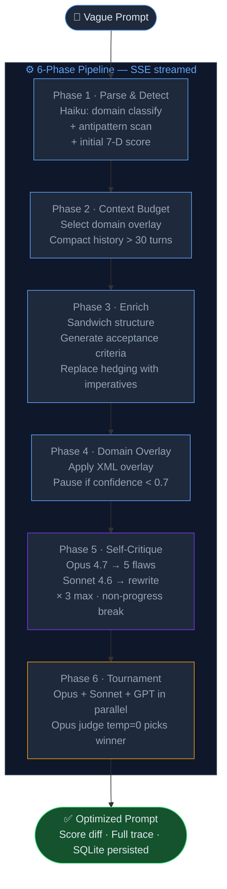

<div align="center">


[](https://nextjs.org)
[](https://typescriptlang.org)
[](https://anthropic.com)
[](https://nodejs.org)
[](https://pnpm.io)
[](https://docker.com)
[](LICENSE)

<br/>

> **Stop guessing. Start engineering.**
> KERNEL transforms vague, underspecified prompts into production-grade, scored, and auditable instructions —
> using a 6-phase pipeline grounded in prompt engineering doctrine 2026.

<br/>

[](vscode://vscode.git/clone?url=https://github.com/manuelcozar55/prompt-optimizer)
[](https://vercel.com/new/clone?repository-url=https://github.com/manuelcozar55/prompt-optimizer)

</div>

---

## The Problem

Most prompt engineering today is trial-and-error guesswork: iterate, eyeball the output, repeat. This produces inconsistent results, hidden regressions, and zero observability.

**KERNEL changes the paradigm.** Every optimization is:

- **Scored** against a calibrated 7-dimension binary rubric
- **Traced** across 6 explicit pipeline phases with token + cost accounting
- **Audited** for antipatterns (sycophancy, over-hedging, filler language)
- **Persisted** with full diffs so you can compare before and after

---

## What It Does

| Capability | Detail |
|---|---|
| **6-Phase Pipeline** | Parse → Context Budget → Enrich → Domain Overlay → Self-Critique → Tournament |
| **7-D Binary Rubric** | clarity · specificity · completeness · groundedness · testability · robustness · cost_efficiency |
| **Antipattern Detection** | 40+ filler/hedging patterns + sycophancy + over-hedging (regex-based, zero LLM cost) |
| **Domain Overlays** | Specialized XML overlays for code · writing · agentic · research · creative · analytical |
| **Model Tournament** | Run Opus 4.7 + Sonnet 4.6 + GPT-5 in parallel, judge picks the winner |
| **Eval Suite** | 30 golden cases across 6 domains with CI gate (−5pp regression blocks merge) |
| **Cache Strategy** | Doctrine cached 1h · conversation 5min · hit-rate dashboard built-in |
| **Budget Guard** | Hard cap per optimization — throws `BudgetExceededError` before any API call |

---

## Architecture



### Model Routing

| Phase | Model | Why |
|---|---|---|
| Parse & Detect | Haiku 4.5 | Zero-shot classify — fast and cheap |
| Enrich · Initial Score | Sonnet 4.6 | Balanced quality/cost for rewrites |
| Self-Critique · Judge | Opus 4.7 | Maximum reasoning quality, temp=0 |
| Tournament GPT slot | GPT-5.4 | Cross-provider diversity |

### The 7-D Rubric

All dimensions are **binary pass/fail** — never a 1–5 scale. Domain-specific weights:

| Dimension | Default | Code | Writing | Agentic |
|---|---|---|---|---|
| clarity | 15% | 15% | 20% | 15% |
| specificity | 15% | 20% | 10% | 20% |
| completeness | 15% | 15% | 15% | 20% |
| groundedness | 15% | 15% | 15% | 10% |
| testability | 15% | **25%** | 10% | **25%** |
| robustness | 10% | 5% | 15% | 5% |
| cost_efficiency | 15% | 5% | 15% | 5% |

Score bands: **production** ≥ 85 · **acceptable** ≥ 65 · **iterate** < 65

---

## Quick Start

### Option A — Local (development)

```bash
# 1. Clone
git clone https://github.com/manuelcozar55/prompt-optimizer.git
cd prompt-optimizer

# 2. Install (Node.js ≥ 20.9.0 required)
pnpm install

# 3. Configure API keys
cp .env.example .env.local
# → edit .env.local and add ANTHROPIC_API_KEY + OPENAI_API_KEY

# 4. Initialize database
pnpm db:migrate

# 5. Start
pnpm dev
# → http://localhost:3000
```

### Option B — Docker (production)

```bash
git clone https://github.com/manuelcozar55/prompt-optimizer.git
cd prompt-optimizer
cp .env.example .env          # add your API keys
docker compose up --build
# → http://localhost:3000
```

> **Node.js ≥ 20.9.0 is required.** Check with `node --version`.
> Install via [nvm](https://github.com/nvm-sh/nvm): `nvm install 20 && nvm use 20`
> or [fnm](https://github.com/Schniz/fnm): `fnm install 20 && fnm use 20`

### Environment variables

```bash
# .env.local  (local dev)  or  .env  (Docker)

ANTHROPIC_API_KEY=sk-ant-...        # Required — Opus 4.7, Sonnet 4.6, Haiku 4.5
OPENAI_API_KEY=sk-...               # Required for Tournament mode (GPT-5.4)
NEXT_PUBLIC_APP_URL=http://localhost:3000
```

---

## UI Tour

| Screen | What you see |
|---|---|
| **Editor** | Monaco editor · domain picker · effort selector (Fast / Balanced / Deep / Max) · budget cap display · tournament toggle |
| **Pipeline Trace** | Animated framer-motion timeline — 6 phases streaming in real-time |
| **Rubric (7-D)** | Recharts radar — before/after overlay comparison |
| **Diff Viewer** | Side-by-side prompt diff with syntax highlighting |
| **History** | Full optimization log with filters by domain, score band, date, favorited |
| **Evals** | Run the 30-case golden suite · view LLM-judge calibration report |
| **Admin** | Cache hit-rate dashboard · GEPA offline trigger |

---

## Project Structure

```
prompt-optimizer/
├── app/
│   ├── (web)/                   # UI route group
│   │   ├── page.tsx             # Editor — main optimization UI
│   │   ├── history/             # Optimization history + filters
│   │   ├── evals/               # Golden suite runner + calibration
│   │   └── admin/               # Cache dashboard + GEPA trigger
│   └── api/
│       ├── optimize/            # POST → SSE 6-phase stream
│       ├── tournament/          # Parallel 3-model tournament
│       ├── score/               # Score a prompt without optimizing
│       └── admin/               # cache-metrics + master-prompt
├── lib/
│   ├── kernel/
│   │   ├── doctrine.ts          # Immutable constants (sandwich, blacklists)
│   │   ├── pipeline.ts          # 6-phase async generator orchestrator
│   │   ├── rubric.ts            # 7-D binary scoring + domain weights
│   │   ├── antipatterns.ts      # Filler / hedging / sycophancy detectors
│   │   ├── agents/              # analyzer · improver · critic · judge
│   │   └── context/             # Universal sandwich + 6 domain overlays
│   ├── llm/
│   │   ├── models.ts            # Pinned model IDs — never inline elsewhere
│   │   ├── anthropic.ts         # SDK with adaptive thinking + retry
│   │   ├── sanitize.ts          # Spotlighting + injection defense
│   │   ├── cache-strategy.ts    # Breakpoints + hit-rate metrics
│   │   ├── budget-guard.ts      # Hard cap enforcement
│   │   └── effort-mapping.ts    # fast / balanced / deep / max → provider values
│   ├── db/                      # Drizzle ORM + better-sqlite3 (WAL mode)
│   └── evals/                   # 30 golden cases · judge calibration · CI gate
├── components/                  # PipelineTrace · ScoreRadar · DiffViewer · …
├── tests/                       # Vitest unit + integration (21 tests, ~2s)
├── docs/
│   ├── ARCHITECTURE.md          # Stack decisions — why not LangChain
│   └── DOCTRINE.md              # Prompt engineering doctrine 2026
├── Dockerfile                   # Multi-stage Node 22 alpine
├── docker-compose.yml           # SQLite volume + healthcheck
├── promptfoo.yaml               # Red-team: injection · jailbreak · PII · harmful
└── .env.example                 # Copy to .env.local before running
```

---

## Development Commands

```bash
# Dev
pnpm dev                  # Dev server → http://localhost:3000
pnpm build                # Production build (standalone, Docker-ready)
pnpm typecheck            # TypeScript strict check
pnpm test                 # Vitest unit tests (~2s)
pnpm lint                 # ESLint

# Database
pnpm db:generate          # Generate Drizzle migrations from schema
pnpm db:migrate           # Apply pending migrations

# Eval suite (requires API keys)
pnpm test:evals           # Run 30 golden cases
pnpm calibrate-judge      # Verify judge F1 ≥ 0.85 per dimension
```

### Ship gate

All four must pass before merging:

```
pnpm typecheck   →  zero TypeScript errors
pnpm test        →  all 21 unit tests pass
pnpm build       →  production build clean
pnpm test:evals  →  pass-rate within −5pp of monthly baseline
```

---

## Tech Stack

| Layer | Technology | Notes |
|---|---|---|
| Framework | Next.js 15 App Router · React 19 | SSE via Route Handlers |
| Language | TypeScript 5 strict | No `any`, no `as unknown` |
| Styling | Tailwind CSS v4 + shadcn/ui | Dark mode default |
| Animation | framer-motion | Pipeline trace timeline |
| Charts | recharts | 7-D radar before/after |
| Editor | Monaco Editor | Lazy loaded, SSR-safe |
| State | TanStack Query v5 | Server state + SSE |
| LLM providers | Anthropic SDK + OpenAI SDK | Adaptive thinking default |
| Validation | Zod v4 | Structured output with retry |
| Database | Drizzle ORM + better-sqlite3 | WAL mode, local-first |
| Logging | Pino structured JSON | Per-trace cache metrics |
| Testing | Vitest + MSW | No DOM, pure node env |
| Red-team | Promptfoo | CI gate < 5% attack success |

---

## Hard Rules

Enforced in `CLAUDE.md` and verified in CI:

1. **`pnpm` only** — never `npm` or `yarn`
2. **Model strings pinned** in `lib/llm/models.ts` — no inline model IDs
3. **No LangChain, LangGraph, CrewAI, AutoGen** at runtime — custom pipeline
4. **All user input through `lib/llm/sanitize.ts`** before the pipeline
5. **Rubric is binary** pass/fail — never a 1–5 scale
6. **No "think step by step"** in prompts to reasoning models
7. **Budget guard required** before any Tournament execution
8. **Stretch eval cases must fail** in baseline — if they pass, the case is too easy

---

## Author

**Manuel Antonio Cózar Baranguán**
*AI Engineer & Innovation Researcher @ Fundación CIRCE*

[](https://linkedin.com/in/manuelcozarb)
[](https://github.com/manuelcozar55)
[](mailto:manuelcozarb@gmail.com)

---

<div align="center">

*From vague intent to production-ready instructions — every time.*


</div>
